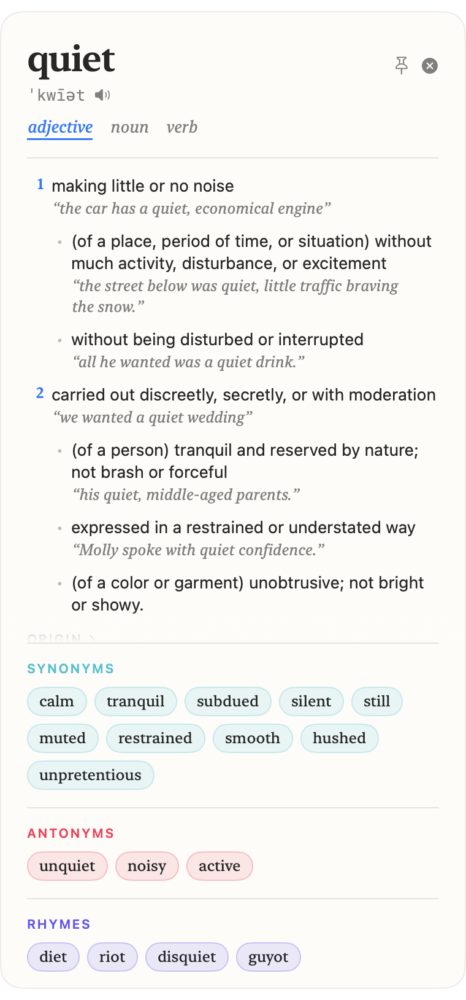
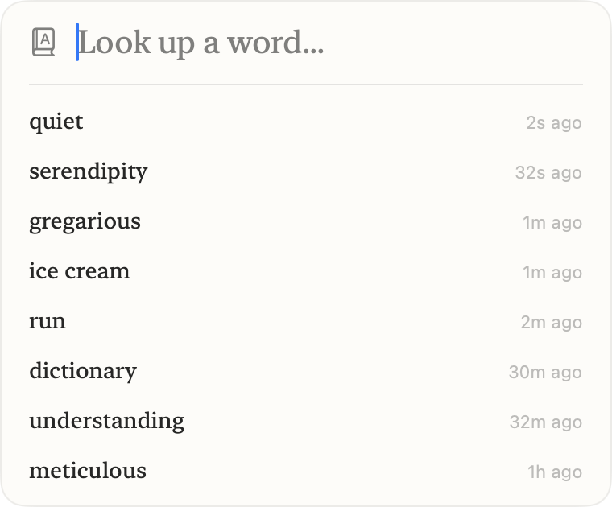

# WordPop

Select a word anywhere on your Mac, press a hotkey, and get its definition, pronunciation, synonyms, antonyms, and rhymes in a popup at your cursor. Fully offline. No accounts, no network calls.

WordPop lives in the menu bar and stays out of the Dock.

<p align="center">
  
  &nbsp;&nbsp;
  
</p>

## Features

- **Lookup from any app.** Select text in a browser, editor, PDF, chat window, or anywhere else, then press `⌃⌥⌘D`. The popup appears next to your mouse.
- **Quick Search.** Press `⌃⌥⌘S` to open a search bar and type a word directly, without selecting text first.
- **Lookup history and type-ahead.** Quick Search lists your recent lookups (kept for 30 days) under the field, then completes what you type from a 69,000-word list. Arrow keys and Return open a row. Clear history from the menu bar menu.
- **Keyboard-first.** Inside the popup: `←`/`→`/`Tab` move through the synonym, antonym, and rhyme pills, `Return` follows one, `1`-`9` switch part of speech, `Space` speaks, `⌘[` goes back, `⌘C` copies the word, `⌘⇧C` copies the first definition, `Esc` closes.
- **Definitions and examples** from the built-in macOS dictionary (the same data as Dictionary.app), parsed into numbered senses and sub-senses. Words with several parts of speech get a verb/noun/adjective switcher.
- **Pronunciation** shown as IPA, plus a speaker button that reads the word aloud with the system voice. Syllable breaks ("me·tic·u·lous") and inflected forms ("runs, running, past ran") come along with it.
- **Synonyms by sense** from the Oxford American Writer's Thesaurus that ships with macOS: each sense gets its example sentence and its own synonyms, with everyday words ahead of informal or archaic ones. Words the Thesaurus lacks fall back to a bundled WordNet and Moby dataset. Antonyms are grouped the same way.
- **Other languages.** If a word is not in the English dictionary, WordPop tries the other dictionaries you have enabled in Dictionary.app (for example Spanish or German) and shows that entry.
- **Rhymes**, ranked by how common the word is, plus near rhymes for words with few perfect ones ("orange" → storage, porridge).
- **Phrases and phrasal verbs** ("on the quiet", "run out of") from the entry, in a collapsible section, along with **etymology**.
- **Preferences** for the two shortcuts, text size, popup position (screen centre or next to the pointer), and Launch at Login.
- **100% offline.** Every lookup runs against local data. Nothing you look up leaves your machine.

## Requirements

- macOS 14 (Sonoma) or later
- Xcode Command Line Tools (for `swift build`)
- Accessibility permission (WordPop needs it to capture your selected text)

## Install

### Download

Grab `WordPop.zip` from the [latest release](https://github.com/tilakp/wordpop/releases/latest), unzip it, and move `WordPop.app` to your Applications folder. The build is not notarized, so on first launch right-click the app and choose **Open**.

### Build from source

```sh
git clone https://github.com/tilakp/wordpop.git
cd wordpop
./setup_signing.sh          # one-time, optional but recommended (see below)
./build_app.sh --install    # builds WordPop.app and copies it to /Applications
open /Applications/WordPop.app
```

On first launch, macOS asks for Accessibility permission. Grant it in **System Settings > Privacy & Security > Accessibility**. Without it, the lookup hotkey cannot read your selection.

### Why `setup_signing.sh`?

macOS ties the Accessibility grant to the app's code signature. An ad-hoc signed build gets a new signature on every rebuild, so the permission resets each time. `setup_signing.sh` creates a local self-signed certificate named "WordPop Local Signing" in your login keychain and trusts it for code signing. `build_app.sh` uses it automatically when present, so the grant survives rebuilds.

This only touches your login keychain. You can remove the certificate in Keychain Access at any time.

## Usage

| Action | Default shortcut |
| --- | --- |
| Look up selected word | `⌃⌥⌘D` |
| Open Quick Search | `⌃⌥⌘S` |

Both shortcuts can be changed from the menu bar icon under **Preferences**.

| In the popup | |
| --- | --- |
| `←` `→` `Tab` `⇧Tab` | Move through the pills |
| `Return` | Look up the focused pill |
| `1` … `9` | Switch part of speech |
| `Space` | Pronounce |
| `⌘[` | Back to the previous word |
| `⌘C` / `⌘⇧C` | Copy the word / the first definition |
| `Esc` | Close |

To inspect what WordPop parses for a word without opening the popup: `.build/release/WordPop --lookup serendipity`. `swift test` runs the parser tests against captured dictionary text in `Tests/WordPopTests/Fixtures`.

## How it works

- **Definitions, pronunciation, etymology:** macOS Dictionary Services. WordPop reads the entry's own XHTML markup (`DCSRecordCopyData`), where every headword, sense, example, label, inflection, and phrase is tagged, and merges homographs such as "lead" (verb) and "lead" (metal). If no record matches, it falls back to parsing the flat text from `DCSCopyTextDefinition`.
- **Synonyms and antonyms:** the Oxford American Writer's Thesaurus (or Oxford Thesaurus of English) installed with macOS, read from its markup the same way. When it has no entry, a bundled JSON dataset generated by `scripts/build_synonyms.py` from the [Open English WordNet](https://github.com/globalwordnet/english-wordnet), topped up with the public-domain [Moby Thesaurus II](https://github.com/words/moby), is used instead.
- **Type-ahead:** `scripts/build_words.py` writes the WordNet lemma list ordered by `wordfreq` frequency.
- All four datasets ship in one SQLite file (`scripts/build_db.py`) queried on demand, so launch does no decoding and the data costs a few megabytes of memory instead of ~100 MB.
- **Rhymes:** generated from the [CMU Pronouncing Dictionary](https://github.com/cmusphinx/cmudict) by `scripts/build_rhymes.py`, ranked by word frequency. Words with fewer than eight perfect rhymes also get near rhymes: same vowels from the last stressed syllable, consonants within one edit per syllable.
- **Text capture:** reads the focused element's selected text through the Accessibility API, which native apps and Chromium browsers expose and which leaves the clipboard alone. Apps that expose nothing (many Electron apps, terminals) fall back to a simulated `⌘C`, reading the clipboard, then restoring it, the technique PopClip and Alfred use. Accessibility permission is required for both.

### Regenerating the datasets

```sh
cd scripts
pip3 install wn gensim wordfreq
python3 -c "import wn; wn.download('oewn:2021')"
curl -sL -o glove-wiki-gigaword-100.gz \
  https://github.com/RaRe-Technologies/gensim-data/releases/download/glove-wiki-gigaword-100/glove-wiki-gigaword-100.gz
python3 build_synonyms.py
python3 build_rhymes.py
python3 build_words.py
python3 build_db.py     # packs the outputs into ../Sources/WordPop/Resources/wordpop.sqlite
```

Synonyms within each part of speech are ranked by GloVe cosine similarity to the headword, which puts everyday synonyms ahead of obscure ones. Moby candidates are accepted only when they share a WordNet part of speech with the headword, are not one of its antonyms, and are among its nearest GloVe neighbours. Rhyme candidates are filtered to WordNet lemmas and ranked by `wordfreq`. The GloVe vectors are only used at build time and are not bundled in the app.

## Project layout

```
Sources/WordPop/       Swift sources (AppKit + SwiftUI)
Sources/WordPop/Resources/  wordpop.sqlite: synonyms, antonyms, rhymes, and the type-ahead word list
Resources/             App icon and Info.plist
scripts/               Python scripts that build the datasets
build_app.sh           Builds and signs WordPop.app
setup_signing.sh       One-time local signing certificate setup
```

## Data attribution

- Open English WordNet is licensed under [CC BY 4.0](https://creativecommons.org/licenses/by/4.0/).
- Moby Thesaurus II by Grady Ward is in the public domain.
- The CMU Pronouncing Dictionary is licensed under a BSD-style license.
- Definitions, thesaurus entries, and bilingual entries come from the dictionaries installed with macOS and are not redistributed by this project. Enumerating those dictionaries uses Dictionary Services functions that Apple ships but does not document (`DCSCopyAvailableDictionaries`, `DCSGetActiveDictionaries`), so this app is not App Store eligible as is.

## License

[MIT](LICENSE)
