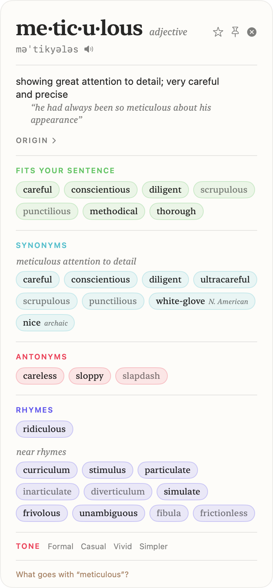
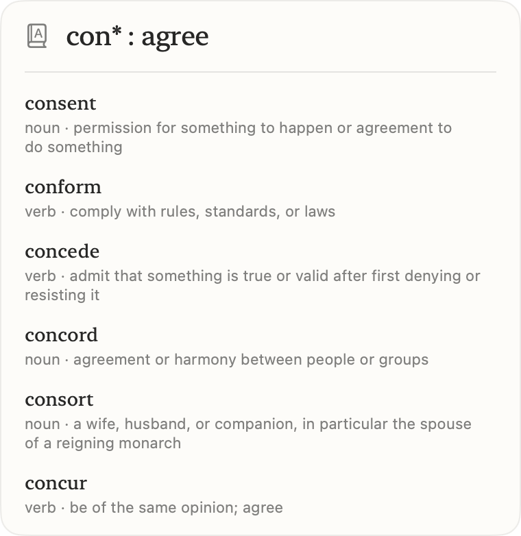

# WordPop

Select a word anywhere on your Mac, press a hotkey, and get its definition, pronunciation, synonyms, antonyms, and rhymes in a popup at your cursor. Fully offline. No accounts, no network calls.

WordPop lives in the menu bar and stays out of the Dock.

<p align="center">
  
  &nbsp;&nbsp;
  
</p>

## Features

- **Lookup from any app.** Select text in a browser, editor, PDF, chat window, or anywhere else, then press `⌃⌥⌘D`. The popup appears in the centre of the screen, or next to the mouse pointer if you choose that in Preferences.
- **Replace with a synonym.** `⌥`-click a pill, or focus it and press `⌥Return`, to put that word in place of your selection. Punctuation, capitalization and word form are kept: "Quiet," becomes "Hushed,", and "ran" replaced with "sprint" becomes "sprinted".
- **Compare two words.** `⇧`-click a pill, or press `⇧Return`, to see it next to the word: both definitions and, with Apple Intelligence, a one-line difference ("famous implies positive recognition; notorious implies negative reputation").
- **Register labels.** Synonyms carry tags such as *informal*, *archaic* or *British*, so the everyday word stands apart from the colloquial one.
- **Stronger words and inclusive alternatives.** Vague words get stronger options ("very tired" → exhausted, "said quietly" → whispered), and gendered or exclusionary words get alternatives ("chairman" → chair, chairperson), from two hand-written lists.
- **What goes with a word.** A button at the bottom of the popup asks the on-device model for common phrases with the word ("strong evidence", "persuasive argument").
- **Fits your sentence.** With Apple Intelligence (macOS 26 or later), the on-device model reads the sentence you selected the word in, picks the sense it is used in, and shows that sense's synonyms first ("She runs a small bakery" → manage, be in charge of). The matching definition moves to the top under "In your sentence". It runs locally; nothing leaves your Mac.
- **Tone shifts.** The Tone buttons list synonyms that are more formal, more casual, more vivid, or simpler (the most common words of that sense), ready for `⌥`-click replace.
- **Rhymes for your line.** When the selected word ends its line, the model picks the rhymes that suit the line's meaning ("…the fading light" → night, white, bright).
- **Usage notes and often-confused words.** The dictionary's usage notes (affect vs effect, fewer vs less) appear in a Usage section, and a hand-written list of 117 groups adds an "Often confused with" row (its/it's, principal/principle, lay/lie).
- **Plain words first.** Synonyms that are rare in everyday English are dimmed, so the plainer choices stand out.
- **Quick Search.** Press `⌃⌥⌘S` to open a search bar and type a word directly, without selecting text first. Start with `?` to describe a meaning instead ("?the smell of rain on dry earth" → petrichor); this uses the on-device model and checks every suggestion against the dictionary.
- **Spelling help.** Not sure how a word is spelled? Type your best guess in Quick Search: if it is misspelled, the close words are listed with their part of speech and first definition, so you can pick the right one by meaning. A misspelled word you select gets a "Did you mean" row in the popup, and `⌥`-click corrects it in place. Suggestions come from the macOS spell checker and work offline.
- **Pattern search.** In Quick Search, `*` stands for any letters and `?` or `_` for one: `b??t` lists best, beat, boat. Add `: meaning` to keep only synonyms of a word: `con* : agree` gives consent, concur.
- **Notes on a passage.** Select eight or more words and press the lookup shortcut to see word and sentence counts, the reading grade, long sentences, possible passive voice, -ly adverbs and repeated words.
- **Starred words.** Star a word in the popup (`⌘D`) to keep it in a personal word bank. Starred words come first in Quick Search, and **Copy Starred Words** in the menu bar menu copies the list.
- **Services, Shortcuts and launchers.** Right-click selected text and choose **Services > Look Up in WordPop**, or open `wordpop://lookup?word=serendipity` (or `wordpop://search`) from Shortcuts, Raycast, Alfred or a script.
- **Lookup history and type-ahead.** Quick Search lists your recent lookups (kept for 30 days) under the field, then completes what you type from a 69,000-word list. Arrow keys and Return open a row. Clear history from the menu bar menu.
- **Keyboard-first.** Inside the popup: `←`/`→`/`Tab` move through the pills, `Return` follows one, `⌥Return` replaces your selection with it, `1`-`9` switch part of speech, `Space` speaks, `⌘[` goes back, `⌘D` stars the word, `⌘C` copies the word, `⌘⇧C` copies the first definition, `Esc` closes.
- **Definitions and examples** from the built-in macOS dictionary (the same data as Dictionary.app), parsed into numbered senses and sub-senses. Words with several parts of speech get a verb/noun/adjective switcher.
- **Pronunciation** shown as IPA (per part of speech for words like "project" and "record"), plus a speaker button that reads the word aloud with the system voice. Syllable breaks ("me·tic·u·lous") and inflected forms ("runs, running, past ran") come along with it.
- **Synonyms by sense** from the Oxford American Writer's Thesaurus that ships with macOS: each sense gets its example sentence and its own synonyms, with everyday words ahead of informal or archaic ones. Words the Thesaurus lacks fall back to a bundled WordNet and Moby dataset. Antonyms are grouped the same way.
- **Other languages.** If a word is not in the English dictionary, WordPop tries the other dictionaries you have enabled in Dictionary.app (for example Spanish or German) and shows that entry.
- **Rhymes**, grouped by syllable count and ranked by how common the word is, plus near rhymes for words with few perfect ones ("orange" → storage, porridge).
- **Phrases and phrasal verbs** ("on the quiet", "run out of") from the entry, in a collapsible section, along with **etymology**.
- **Preferences** for the two shortcuts, text size, popup position (screen centre or next to the pointer), and Launch at Login.
- **100% offline.** Every lookup runs against local data, and the language model features use Apple's on-device model. Nothing you look up leaves your machine.

## Requirements

- macOS 14 (Sonoma) or later
- Xcode, to build from source. On macOS 27 the Command Line Tools alone cannot build the SwiftUI views: if `swift build` reports that the plugin for `SwiftUIMacros` is not found, run `export DEVELOPER_DIR=/Applications/Xcode.app/Contents/Developer` first, or switch with `sudo xcode-select -s /Applications/Xcode.app`.
- Accessibility permission (WordPop needs it to capture your selected text)

## Install

### Download

There is no published release yet. Every push to `main` builds `WordPop.zip` as an artifact of the [Build workflow](https://github.com/tilakp/wordpop/actions/workflows/build.yml) (sign in to GitHub to download it), or build from source below. The build is not notarized, so on first launch right-click the app and choose **Open**.

### Build from source

```sh
git clone https://github.com/tilakp/wordpop.git
cd wordpop
./setup_signing.sh          # one-time, optional but recommended (see below)
./build_app.sh --install    # builds WordPop.app and copies it to /Applications
open /Applications/WordPop.app
```

On first launch, macOS asks for Accessibility permission. Grant it in **System Settings > Privacy & Security > Accessibility**. Without it, the lookup hotkey cannot read your selection.

### Why `setup_signing.sh`?

macOS ties the Accessibility grant to the app's code signature. An ad-hoc signed build gets a new signature on every rebuild, so the permission resets each time. `setup_signing.sh` creates a local self-signed certificate named "WordPop Local Signing" in your login keychain and trusts it for code signing. `build_app.sh` uses it automatically when present, so the grant survives rebuilds.

This only touches your login keychain. You can remove the certificate in Keychain Access at any time.

## Usage

| Action | Default shortcut |
| --- | --- |
| Look up selected word | `⌃⌥⌘D` |
| Open Quick Search | `⌃⌥⌘S` |

Both shortcuts can be changed from the menu bar icon under **Preferences**.

| In the popup | |
| --- | --- |
| `←` `→` `Tab` `⇧Tab` | Move through the pills |
| `Return` | Look up the focused pill |
| `⌥Return` or `⌥`-click | Replace your selection with the pill |
| `⇧Return` or `⇧`-click | Compare the pill with the word |
| `1` … `9` | Switch part of speech |
| `Space` | Pronounce |
| `⌘[` | Back to the previous word |
| `⌘D` | Star or unstar the word |
| `⌘C` / `⌘⇧C` | Copy the word / the first definition |
| `Esc` | Close |

To inspect what WordPop parses for a word without opening the popup: `.build/release/WordPop --lookup serendipity`. `--describe "a strong desire to travel"` runs the describe search, `--compare stubborn obstinate` a comparison and `--collocations argument` the phrase search. `swift test` runs the parser tests against captured dictionary text in `Tests/WordPopTests/Fixtures`.

## How it works

- **Definitions, pronunciation, etymology:** macOS Dictionary Services. WordPop reads the entry's own XHTML markup (`DCSRecordCopyData`), where every headword, sense, example, label, inflection, and phrase is tagged, and merges homographs such as "lead" (verb) and "lead" (metal). If no record matches, it falls back to parsing the flat text from `DCSCopyTextDefinition`.
- **Synonyms and antonyms:** the Oxford American Writer's Thesaurus (or Oxford Thesaurus of English) installed with macOS, read from its markup the same way. When it has no entry, a bundled JSON dataset generated by `scripts/build_synonyms.py` from the [Open English WordNet](https://github.com/globalwordnet/english-wordnet), topped up with the public-domain [Moby Thesaurus II](https://github.com/words/moby), is used instead.
- **Type-ahead:** `scripts/build_words.py` writes the WordNet lemma list ordered by `wordfreq` frequency.
- All four datasets ship in one SQLite file (`scripts/build_db.py`) queried on demand, so launch does no decoding and the data costs a few megabytes of memory instead of ~100 MB.
- **Rhymes:** generated from the [CMU Pronouncing Dictionary](https://github.com/cmusphinx/cmudict) by `scripts/build_rhymes.py`, ranked by word frequency. Words with fewer than eight perfect rhymes also get near rhymes: same vowels from the last stressed syllable, consonants within one edit per syllable.
- **Text capture:** reads the focused element's selected text through the Accessibility API, which native apps and Chromium browsers expose and which leaves the clipboard alone. Apps that expose nothing (many Electron apps, terminals) fall back to a simulated `⌘C`, reading the clipboard, then restoring it, the technique PopClip and Alfred use. Accessibility permission is required for both.

### Regenerating the datasets

```sh
cd scripts
pip3 install wn gensim wordfreq
python3 -c "import wn; wn.download('oewn:2021')"
curl -sL -o glove-wiki-gigaword-100.gz \
  https://github.com/RaRe-Technologies/gensim-data/releases/download/glove-wiki-gigaword-100/glove-wiki-gigaword-100.gz
python3 build_synonyms.py
python3 build_rhymes.py
python3 build_words.py
python3 build_db.py     # packs the outputs into ../Sources/WordPop/Resources/wordpop.sqlite
```

Synonyms within each part of speech are ranked by GloVe cosine similarity to the headword, which puts everyday synonyms ahead of obscure ones. Moby candidates are accepted only when they share a WordNet part of speech with the headword, are not one of its antonyms, and are among its nearest GloVe neighbours. Rhyme candidates are filtered to WordNet lemmas and ranked by `wordfreq`. The GloVe vectors are only used at build time and are not bundled in the app.

## Project layout

```
Sources/WordPop/       Swift sources (AppKit + SwiftUI)
Sources/WordPop/Resources/  wordpop.sqlite: synonyms, antonyms, rhymes, and the type-ahead word list
Resources/             App icon and Info.plist
scripts/               Python scripts that build the datasets
build_app.sh           Builds and signs WordPop.app
setup_signing.sh       One-time local signing certificate setup
```

## Data attribution

- Open English WordNet is licensed under [CC BY 4.0](https://creativecommons.org/licenses/by/4.0/).
- Moby Thesaurus II by Grady Ward is in the public domain.
- The CMU Pronouncing Dictionary is licensed under a BSD-style license.
- Definitions, thesaurus entries, and bilingual entries come from the dictionaries installed with macOS and are not redistributed by this project. Enumerating those dictionaries uses Dictionary Services functions that Apple ships but does not document (`DCSCopyAvailableDictionaries`, `DCSGetActiveDictionaries`), so this app is not App Store eligible as is.

## License

[MIT](LICENSE)
